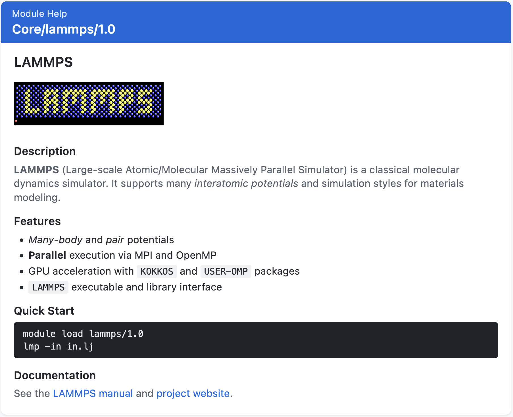

.. _markdown_help-label:

Markdown in Module Help and Whatis
==================================

Lmod detects and formats markdown in ``help()`` and ``whatis()`` strings.
When you run ``module help <name>`` or ``module whatis <name>``, the output
shows formatted text (bold, headers, lists, etc.) in the terminal. No
configuration is needed; detection runs automatically.

How it works
------------

First Lmod decides whether the content looks like markdown. It scores
things like headers, lists, and emphasis. Plain text (e.g., environment
variable dumps) usually scores low and is left as-is. If the score is
high enough, Lmod converts the markdown to ANSI formatting for the
terminal.

What you can use
----------------

* **Headers** — ``#``, ``##``, ``###`` or underline with ``===`` or ``---``
* **Lists** — ``-``, ``*``, ``+`` or ``1.``, ``2.`` (up to 3 spaces indent)
* **Emphasis** — ``*bold*``, ``**bold**``, ``_italic_``
* **Inline code** — single backticks
* **Code blocks** — triple backticks
* **Links** — ``[text](url)``
* **Images** — ```` (shown as ``[Image: alt] (url)`` in the terminal)

Example
-------

A modulefile might look like::

    help([[
    # LAMMPS

    ## Description
    **LAMMPS** is a molecular dynamics simulator. It supports many
    *interatomic potentials* and simulation styles.

    ## Quick Start
    ```bash
    module load lammps/1.0
    lmp -in in.lj
    ```

    See the [manual](https://docs.lammps.org/) for details.
    ]])

The terminal shows formatted headers, lists, and code. The screenshot
below shows the same content rendered in a web interface.



   Example of formatted module help (LAMMPS).

What works and what doesn't
---------------------------

Output uses ANSI colors when your terminal supports it (e.g., ``xterm``,
``screen``) or when ``LMOD_COLORIZE=yes``. Bold, italic, and code work
inside list items. The parser is pure Lua.

Content under 30 characters is never treated as markdown. Tables,
blockquotes, and footnotes are not supported. Images show as
``[Image: alt text] (url)``; terminals can't display them. Sometimes
Lmod misses markdown or formats plain text by mistake. See below for how
the scoring works.

.. _markdown_detection:

How detection works
-------------------

Lmod scores the content. Each markdown-like pattern adds points: headers (+3),
code blocks (+3), links (+2), images (+2), lists (+2), emphasis (+1).
If the score reaches 3 or more, the content is formatted as markdown.

The scoring is conservative. List items with more than 3 spaces of
indentation are ignored. Structure alone doesn't add points. This reduces
false positives (e.g., formatting a variable list as markdown).

Troubleshooting
----------------

**Content shows as plain text**

* Make sure it's at least 30 characters.
* Add more markdown (headers, lists, emphasis) to raise the score.
* Keep list indentation to 0–3 spaces.

**Inspecting detection**

Use the debug flag::

   % module -D help <moduleName> 2> debug.log

Search for ``MarkdownDetector`` in the log to see the score and which
indicators were found.

For implementation details, see :ref:`deepdive_markdown`.
